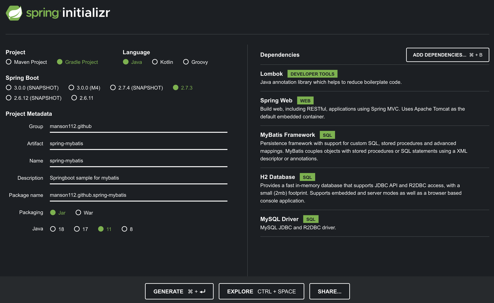
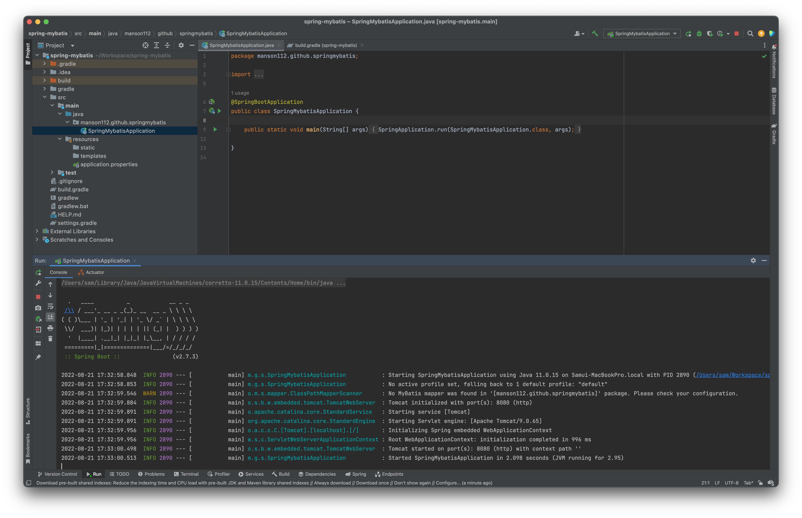
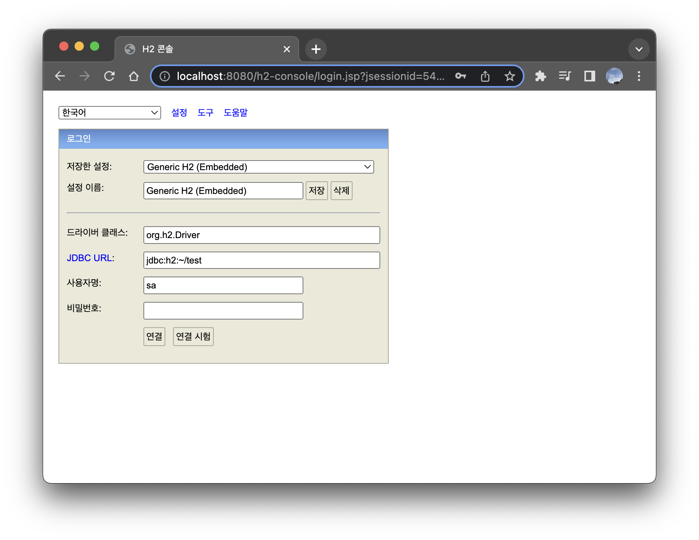
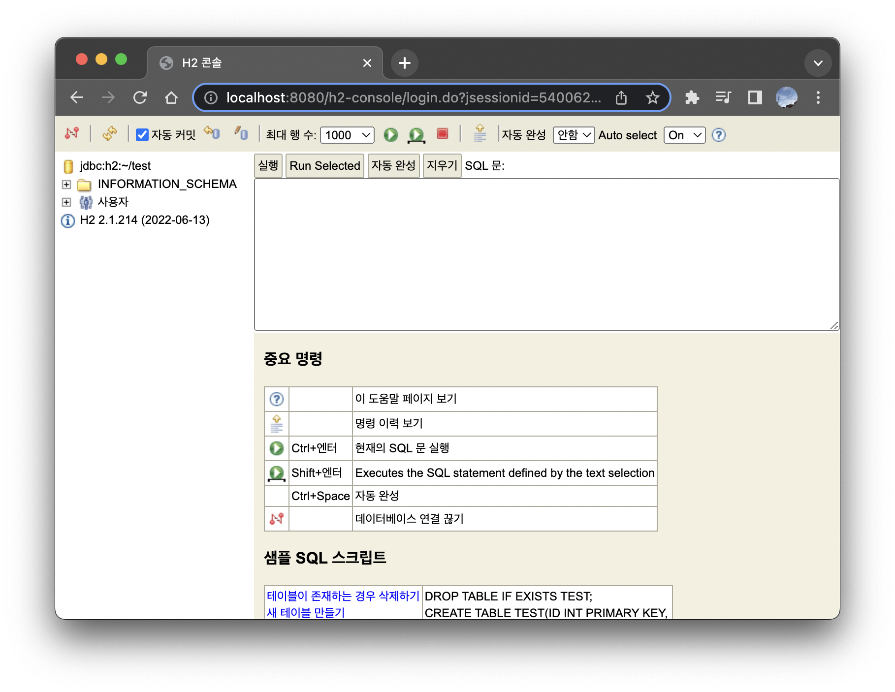
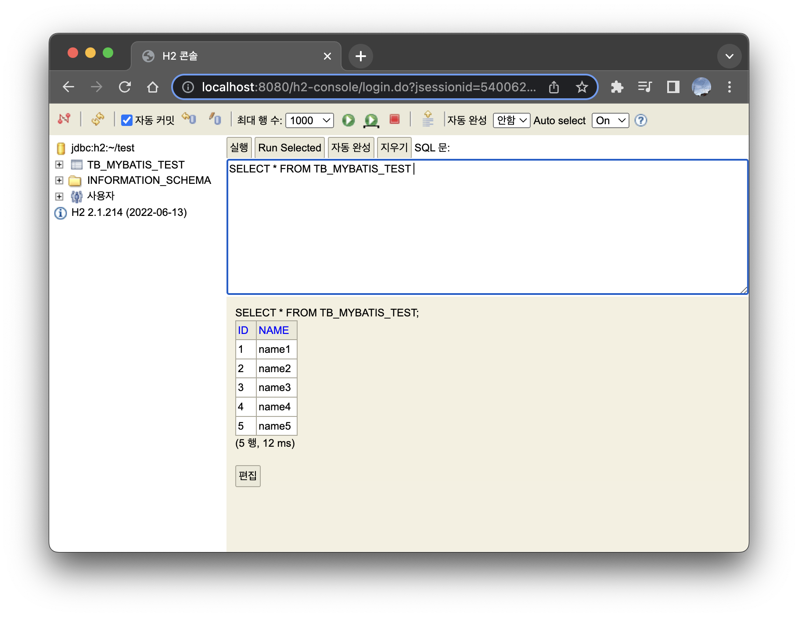
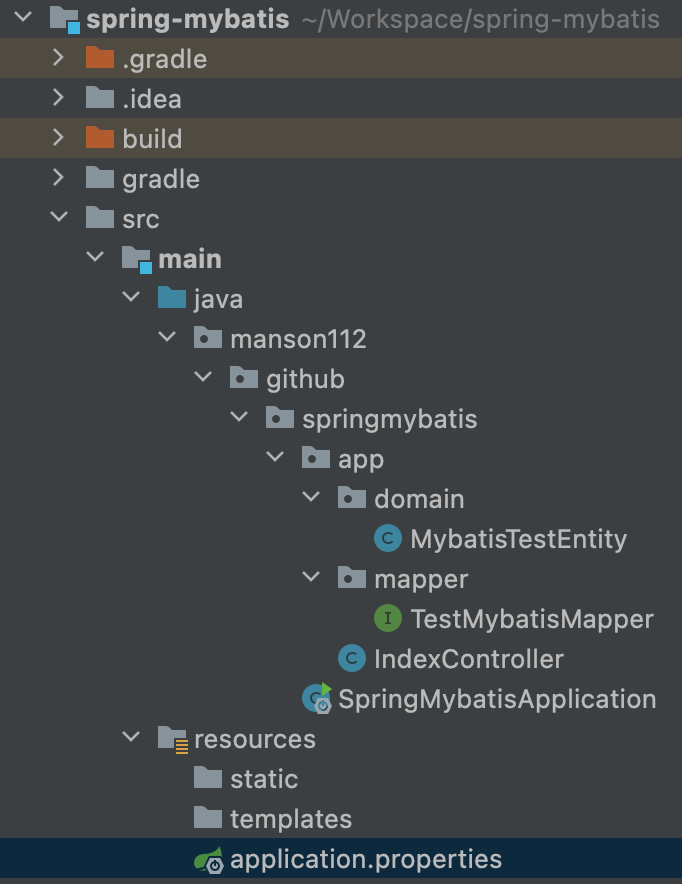
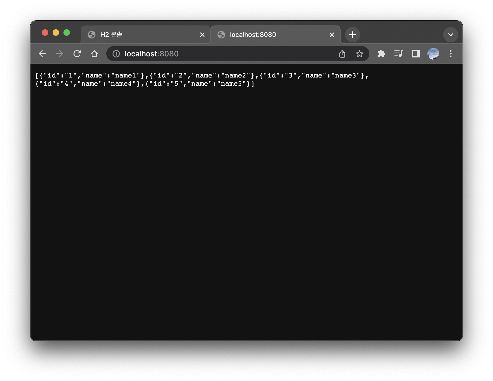
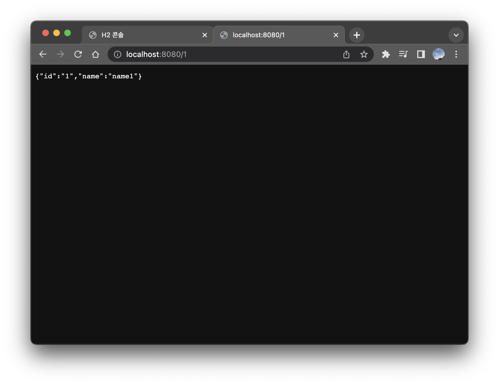

<!--more-->
Spring에 Mybatis를 연동 방법을 알아보자. 의외로 매우 간단하다.

# 1. Springboot 프로젝트 생성

스프링부트 프로젝트는 [https://start.spring.io](https://start.spring.io) 에 접속해서 필요한 정보들을 선택해서 생성하면 아주 쉽게 생성할 수 있다. 

나는 Gradle, Java(11), Springboot(2.7.3) 을 선택했다.

Dependency로는 Lombok, Spring Web, 그리고 오늘 사용할 Mybatis Framework, 데이터베이스를 따로 설정하지 않고 메모리에서 동작하게 할 것이기 때문에 가벼운 H2 Database를 선택했다.



이제 Generate를 클릭하고 압축을 푼 후에 IntelliJ 에서 열어주자

# 2. Springboot 동작 확인

Springboot를 한번 실행시켜 본다. 



# 3. H2 Console 설정

[application.properties](http://application.properties) 파일을 열어 다음과 같이 적어준다

```java
spring.h2.console.enabled=true // 콘솔을 활성화 시킨다
// 다음은 h2-console이 실행될때의 기본설정이다
spring.datasource.url=jdbc:h2:~/test;
spring.datasource.driverClassName=org.h2.Driver
spring.datasource.username=sa
spring.datasource.password=  // 입력하지 않아도 된다.

spring.h2.console.path=/h2-console // 콘솔의 경로를 변경할 수 있다.
```

저장 후 서버를 재실행 시킨다. 

브라우저를 열어 [http://localhost:8080/h2-console](http://localhost:8080/h2-console) 로 접속하면 다음과 같은 화면을 확인할 수 있다.



기본적으로 설정이 들어가 있는데, 위에서 같은 설정으로 서버를 실행했기 때문에 수정하지 않고 연결 버튼을 누르면, 다음과 같이 콘솔에 접속된다.



# 4. 테이블 생성

이 포스트의 목적은 Springboot에서 Mybatis를 연결하여 database를 이용하는 것이기 때문에, 임시로 데이터를 넣어놓고 조회가 잘 되는지 확인할 것이다. 

가운데 있는 텍스트필드에 다음 명령들을 입력 후 실행시킨다.

```sql
create table tb_mybatis_test (id int primary key auto_increment, name varchar(255)); 
insert into tb_mybatis_test (name) values ('name1');
insert into tb_mybatis_test (name) values ('name2');
insert into tb_mybatis_test (name) values ('name3');
insert into tb_mybatis_test (name) values ('name4');
insert into tb_mybatis_test (name) values ('name5');
```

성공 했다면 Select 쿼리를 날려 데이터가 잘 들어갔는지 확인해보자.



# 5. Springboot에서 조회하기 - Mapper

데이터를 조회하기 위한 Controller, Entity, Mapper 를 작성한다. 

디렉토리 구조는 다음과 같다.



일반적은 3계층 구조라면 Service도 필요하겠지만, 비즈니스 로직을 넣을 것이 아니기 때문에 생략했다.

### MybatisTestEntity.java

```java
@Getter
public class MybatisTestEntity {
    private String id;
    private String name;

    @Builder
    public MybatisTestEntity(String id, String name) {
        this.id = id;
        this.name = name;
    }
}
```

### IndexController.java

```java
@RestController
@RequiredArgsConstructor
public class IndexController {
    private final TestMybatisMapper testMybatisMapper;

    @GetMapping("/")
    public List<MybatisTestEntity> index() { // 전체 목록을 조회
        return testMybatisMapper.findAll();
    }

    @GetMapping("/{id}")
    public MybatisTestEntity findById(@PathVariable String id) {
        return testMybatisMapper.findById(id);
    }
}
```

@RestController: @ResponseBody 어노테이션을 붙이지 않아도 문자열과 JSON 등을 전송할 수 있다.

@RequiredArgsConstructor:클래스 필드 중 final로 선언되거나, @NotNull 이 붙은 필드를 주입받는 Constructor를 생성한다.

### TestMybatisMapper.java

```java
@Mapper
public interface TestMybatisMapper {
    @Select("select * from tb_mybatis_test")
    public List<MybatisTestEntity> findAll();

    @Select("select * from tb_mybatis_test where id=#{id}")
    public MybatisTestEntity findById(@Param("id") String id);

}
```

Mapper가 Interface 인 것을 유의하자. 사용할 SQL을 Annotation으로 각각 메서드 위에 작성해준다. 

@Param Annotation으로 쿼리 내부의 #{id} 필드에 파라미터를 매핑 해준다.

 

# 6. 확인

저장하고 서버를 재실행 시킨 후 브라우저를 열어 [http://localhost:8080](http://localhost:8080) 에 접속해보자



테이블에 들어있는 데이터들이 모두 조회된다.

다음은 [http://localhost:8080/1](http://localhost:8080/1) 을 입력하여 id가 1인 데이터가 잘 조회 되는지 확인해보자



[GitHub - manson112/spring-mybatis-sample](https://github.com/manson112/spring-mybatis-sample)
